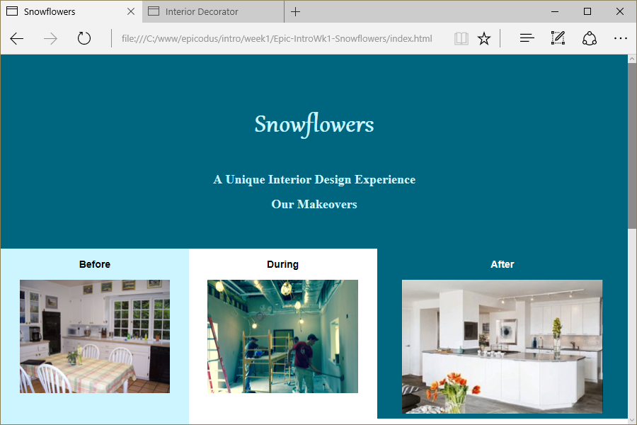

# Snowflowers (Interior Design Website)
Version 0.0.1: August 3, 2016
by [Karen Freeman-Smith](https://karenfreemansmith.github.io) and [Addison Nishijima](https://github.com/AddisonNishijima)

### Technologies Used
HTML, CSS, Git, Github

## Description
*[Epicodus](http://epicodus.com) Intro to Programming Week 1 Pair Project with Addison Nishijima: Create an interior decorator site with columns for before/during/after to practice CSS page layout with floats.*

## Setup/Installation
* [View on Github Pages](https://karenfreemansmith.github.io/Epic-IntroWk1-Snowflowers/)
* _OR_
* Clone directory
* Open index.html in your favorite browser

## Support & Contact
For questions, concerns, or suggestions please email karenfreemansmith@gmail.com

## Known Issues
* None

## Legal
*Licensed under the GNU General Public License v3.0*
Copyright (c) 2016 Copyright _[Karen Freeman-Smith](https://karenfreemansmith.github.io) & [Addison Nishijima](https://github.com/AddisonNishijima)_ All Rights Reserved.
